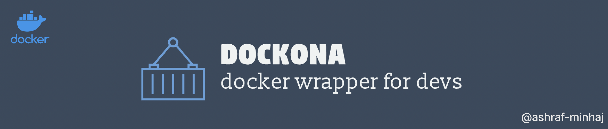

<div align="center">

# Dockona
 *Tool to simplify local development using Docker*



&nbsp;
&nbsp;

</div>

## Usage

- Install latest version of docker in your system
- Install python3 on your system (should come with your distro BTW)
- Install dockona. Go to your terminal and run -
    ```
        $ pip install dockona
    ```

- Now run the tool from your 'app' directory. 
     ```
        $ dockona run --app-name devfrontend
    ```

- example `dockona --help` -
    ``` 
        Usage: dockona [OPTIONS] COMMAND [ARGS]...

        Options:
        --install-completion [bash|zsh|fish|powershell|pwsh]
                                        Install completion for the specified shell.
        --show-completion [bash|zsh|fish|powershell|pwsh]
                                        Show completion for the specified shell, to
                                        copy it or customize the installation.
        --help                          Show this message and exit.

        Commands:
        get-errors   get application errors.
        get-logs     get application logs.
        list-images  get list of images.
        ls           get list of things in current directory, use it to see if...
        run          run the application.
        stop         stop the running application.
    ```